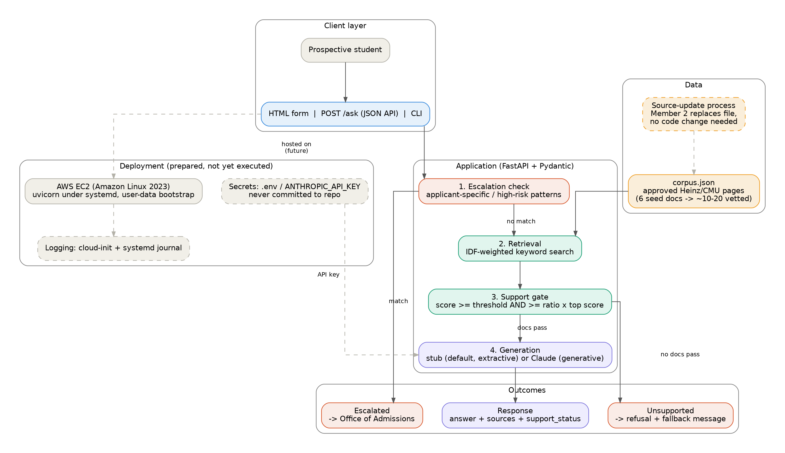

# TM1 — Foundation & Architecture

**Heinz Admissions Navigator**

## 1. Purpose and scope

The Heinz Admissions Navigator is a retrieval-based admissions information service for prospective Heinz College students, with a conversational interface layered on top of a real API. It answers questions about deadlines, requirements, tuition, program formats, and similar topics, using only content retrieved from an approved set of official Heinz and CMU pages, and it declines or escalates anything outside that boundary.

This document describes the system as it currently runs: a functional end-to-end prototype using a stub generation backend by default and a keyword-based retriever, rather than the embedding pipeline planned for later milestones.

## 2. System architecture

A student's question enters through one of three equivalent interfaces, passes through an escalation check, is matched against the approved corpus, is gated for sufficient evidence, and is answered by a swappable generation backend. Two exit paths, escalation and refusal, sit alongside the main flow so that low-confidence or out-of-scope questions never reach generation.

*Figure 1. Request flow through the Heinz Admissions Navigator prototype, current TM1 state.*

## 3. Components

- **Escalation check.** The question is matched against a fixed set of applicant-specific and high-risk patterns (phrases like admission chances, visa or immigration, or requests to guarantee an outcome). A match routes straight to a human referral and skips retrieval and generation entirely.
- **Retrieval.** Every document in the approved corpus is scored against the question using IDF-weighted keyword overlap, and the top-scoring passages are kept.
- **Support gate.** A retrieved passage is only kept as a citation if its score clears an absolute floor and is also close to the best-scoring result. This keeps a common word like "Heinz" from dragging an unrelated page into the answer, and it is the decision point that separates a supported answer from a refusal.
- **Generation.** If at least one passage passes the gate, a generation backend writes the answer from the retained passages. If none pass, the pipeline returns a refusal with fallback contact information instead of guessing.
- **Secrets and configuration.** API keys and tunable parameters (support threshold, top-k, model name) are read from environment variables and are never committed to the repository.
- **Logging.** Deployment-level logging runs through cloud-init and the systemd journal.

## 4. Why these technology choices

| Choice | Rationale |
|---|---|
| FastAPI | Async, API-first, auto-generated docs; matches the requirement that the service be a real API and not merely a chat wrapper. |
| Pydantic | Enforces the request and response contract as structured, validated output rather than loose JSON. |
| IDF keyword retrieval | Simple, explainable, and fast to implement correctly in the time available; embedding-based semantic search is deferred so the rest of the pipeline (gating, refusal, escalation) can be validated before adding retrieval complexity. |
| Swappable generation backend | Runs the full system with zero secrets and zero cost by default, while supporting a real LLM behind one environment variable. |
| Env-var configuration | Keeps secrets and tunable parameters out of the repository entirely. |

## 5. Data flow

**question → HTML/API/CLI → FastAPI → escalation check → retrieval → support gate → generation (stub/Claude) → answer with source citations**, with an escalation path to the Office of Admissions and a refusal path when no source clears the support gate.

## 6. Key tradeoffs

- **Keyword vs. embedding retrieval:** simplicity and explainability now, in exchange for weaker semantic recall until embeddings are introduced in later milestones.
- **Stub vs. LLM generation:** reproducible, free, and fully testable in stub mode, versus fluent generative answers that introduce cost and nondeterminism in Claude mode.
- **Extractive vs. generative answers:** the stub's verbatim-passage answers are maximally faithful to the source but read less naturally than a generated answer would.
- **Governance in code vs. governance in policy:** escalation and refusal rules currently live inside `pipeline.py`, which keeps them enforceable and testable, but requires the written policy to be kept in sync with the code by hand.

## 7. Assumptions and open dependencies

- **Refusal wording.** The fallback string hard-coded in `pipeline.py` does not yet match the written policy's exact wording. A canonical version needs to be agreed on and synced into the code.
- **Corpus.** The current 6 seed documents unblock the prototype but are not the final vetted source set; a curated inventory of roughly 10–20 pages will replace them.
- **Escalation trigger list.** The current phrase list (admission chances, visa, immigration, guarantee language, and similar) is encoded in code and should be reviewed against the governance policy.
- **Deployment.** The service has been deployed and tested on EC2 in the AWS Academy Learner Lab using the bootstrap script and console guide in `deploy/`. Because Learner Lab sessions shut down after a few hours, no instance is left running; the deployment is intentionally scripted so it can be recreated from scratch in minutes for any demo or grading session.

## 8. Where this goes next

- Add the delivery pipeline, evaluation gates, observability, and security hardening on top of this same architecture.
- Replace the keyword retriever with an embedding pipeline (webpage → text → chunks → embeddings → vector store) behind the same `Retriever` interface, so the rest of the application does not need to change.
